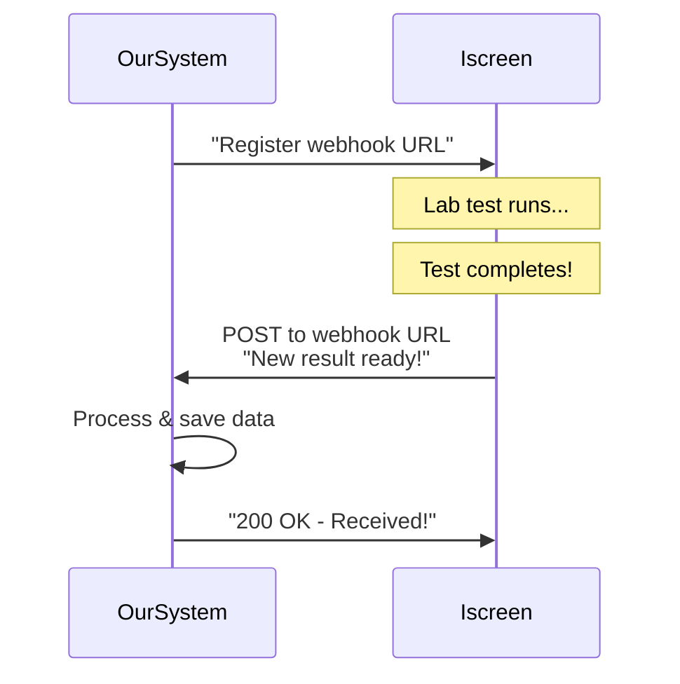

# Database & API Basics: A Beginner's Guide

This guide is designed to help you understand the fundamentals of how our Biomap system works, even if you're new to databases and APIs. We'll use simple analogies and diagrams to make everything clear.

## Table of Contents

1. [What is a Relational Database?](#what-is-a-relational-database)
2. [How Relational Databases Work](#how-relational-databases-work)
3. [Tables, Rows, and Columns](#tables-rows-and-columns)
4. [Relationships Between Tables](#relationships-between-tables)
5. [What is an API?](#what-is-an-api)
6. [What is a Webhook?](#what-is-a-webhook)
7. [How Iscreen Integrates with Our Database](#how-iscreen-integrates-with-our-database)

---

## What is a Relational Database?

### The Library Analogy

Imagine a library with thousands of books. In a relational database:

- **Tables** = Different sections of the library (Fiction, Science, History)
- **Rows** = Individual books in each section
- **Columns** = Information about each book (Title, Author, ISBN, Publication Year)
- **Database** = The entire library building

A **relational database** is like a well-organized library where:
- Books are organized by category (tables)
- Each book has consistent information (columns)
- Books can reference other books or sections (relationships)
- You can find information quickly using an organized system

### Why "Relational"?

The word "relational" means the tables are **connected** or **related** to each other. Just like in a library, a book about "World War II" might reference other books in the History section, our database tables reference each other to avoid storing the same information multiple times.

---

## How Relational Databases Work

### The Filing Cabinet Analogy

Think of a relational database like a sophisticated filing cabinet system:

```
┌─────────────────────────────────────────────────────────┐
│                    THE DATABASE                          │
│                  (The Filing Cabinet)                    │
├─────────────────────────────────────────────────────────┤
│                                                           │
│  ┌──────────────┐    ┌──────────────┐    ┌──────────┐ │
│  │   Drawer 1   │    │   Drawer 2   │    │ Drawer 3 │ │
│  │  (Patients)  │───▶│ (Lab Tests)  │───▶│ (Results)│ │
│  │              │    │              │    │          │ │
│  └──────────────┘    └──────────────┘    └──────────┘ │
│                                                           │
│  Each drawer (table) contains organized folders (rows)   │
│  Each folder has labels (columns) with information       │
│  Drawers are connected by reference numbers (keys)       │
└─────────────────────────────────────────────────────────┘
```

### Key Concepts

1. **No Duplication**: Information is stored once and referenced (like a library catalog card pointing to a book)
2. **Organization**: Related information is grouped together (like all patient info in one drawer)
3. **Consistency**: Every record follows the same structure (like every book has a title, author, etc.)
4. **Fast Retrieval**: You can find information quickly using indexes (like a library's card catalog)

---

## Tables, Rows, and Columns

### The Spreadsheet Analogy

If you've used Excel or Google Sheets, you're already familiar with the basic structure! A database table looks a lot like a spreadsheet:

```
┌─────────────────────────────────────────────────────────────┐
│           biomap_measurement_types (Table Name)              │
├──────────┬──────────────┬──────────────┬──────────────────┤
│ id       │ name         │ unit         │ description       │ ← Columns
├──────────┼──────────────┼──────────────┼──────────────────┤
│ uuid-1   │ Hemoglobin   │ g/dL         │ Blood protein    │ ← Row 1
│ uuid-2   │ Glucose      │ mmol/L       │ Blood sugar      │ ← Row 2
│ uuid-3   │ Testosterone │ ng/dL        │ Male hormone     │ ← Row 3
└──────────┴──────────────┴──────────────┴──────────────────┘
```

### Breaking It Down

- **Table**: A collection of related data (like "biomap_measurement_types")
  - Think: A single spreadsheet tab
  
- **Column**: A specific type of information (like "name", "unit", "description")
  - Think: A vertical column in a spreadsheet
  - Also called: A "field" or "attribute"
  
- **Row**: A single record with all its information
  - Think: A horizontal row in a spreadsheet
  - Also called: A "record" or "entry"

### Real Example from Our Database

**Table: `biomap_measurement_types`**
```
┌──────────┬───────────────────────┬──────────┬────────────────────┐
│ id       │ name                  │ slug     │ canonical_unit_id  │
├──────────┼───────────────────────┼──────────┼────────────────────┤
│ abc-123  │ Hemoglobin            │ hemoglobin│ xyz-789           │
│ def-456  │ Testosterone (Total)  │ testosterone_total │ mno-321 │
└──────────┴───────────────────────┴──────────┴────────────────────┘
```

Each row represents one type of lab test we can measure (like Hemoglobin or Testosterone).

---

## Relationships Between Tables

### The Recipe Book Analogy

Imagine you're organizing a recipe book:

- **Recipe Table**: Lists all recipes (name, cooking time, difficulty)
- **Ingredient Table**: Lists all ingredients (name, unit, category)
- **Recipe-Ingredient Table**: Connects recipes to ingredients (which recipe uses which ingredient, and how much)

You wouldn't write "2 cups of flour" in every recipe that uses flour. Instead:
1. You list "flour" once in the Ingredient Table
2. Each recipe references the ingredient by ID
3. A connecting table says "Recipe #5 uses Ingredient #12 (flour), 2 cups"

This is exactly how relational databases work!

### Types of Relationships

#### 1. One-to-Many (Most Common)

**Analogy**: One customer can place many orders.

```
Customer Table          Order Table
┌──────────┬──────┐    ┌──────────┬──────────┬──────┐
│ id       │ name │    │ id       │ cust_id  │ date │
├──────────┼──────┤    ├──────────┼──────────┼──────┤
│ 1        │ John │───▶│ 101      │ 1        │ ...  │
│ 2        │ Jane │    │ 102      │ 1        │ ...  │
└──────────┴──────┘    │ 103      │ 2        │ ...  │
                       └──────────┴──────────┴──────┘
```

In our database:
- **One measurement type** (like "Hemoglobin") can have **many reference ranges** (different ranges for men, women, children)

#### 2. Many-to-Many

**Analogy**: Students and classes. One student takes many classes, one class has many students.

This requires a "junction" or "linking" table:

```
Student Table     Student_Class Table     Class Table
┌────┬──────┐    ┌────────┬────────┐    ┌────┬────────┐
│ id │ name │    │ stud_id│class_id│    │ id │ name   │
├────┼──────┤    ├────────┼────────┤    ├────┼────────┤
│ 1  │ John │───▶│ 1      │ 101    │───▶│ 101│ Math   │
│ 2  │ Jane │    │ 1      │ 102    │───▶│ 102│ Science│
└────┴──────┘    │ 2      │ 101    │    └────┴────────┘
                 └────────┴────────┘
```

In our database:
- Measurement types can have multiple units (through conversion tables)
- Units can be used by multiple measurement types

### Primary Keys and Foreign Keys

**Primary Key (ID)**: Like a social security number or employee ID
- Unique to each row
- Never changes
- Used to identify a specific record

**Foreign Key**: A reference to another table's primary key
- Like writing "Customer ID: 5" on an order form
- Links tables together
- Maintains relationships

```
Example from Our Database:

biomap_measurement_types          biomap_reference_ranges
┌──────────┬──────────┐          ┌──────────┬──────────────┬──────┐
│ id (PK)  │ name     │          │ id (PK)  │ measurement_ │ min  │
├──────────┼──────────┤          │          │ type_id (FK) │      │
│ uuid-123 │ Hemoglobin│────────▶│ uuid-456 │ uuid-123     │ 12.0 │
│ uuid-789 │ Glucose  │          │ uuid-457 │ uuid-123     │ 13.5 │
└──────────┴──────────┘          └──────────┴──────────────┴──────┘
     ↑                                    │
     │                                    │
  Primary Key                      Foreign Key
  (Unique ID)                    (Points to Primary Key)
```

---

## What is an API?

### The Restaurant Analogy

An **API (Application Programming Interface)** is like a restaurant menu and waiter system:

```
┌─────────────┐         ┌──────────┐         ┌──────────┐
│   You       │         │  Waiter  │         │  Kitchen │
│ (Your App)  │────────▶│  (API)   │────────▶│ (Database)│
│             │ Request │          │ Process │          │
│             │◀────────│          │◀────────│          │
│             │ Response│          │ Result  │          │
└─────────────┘         └──────────┘         └──────────┘
```

1. **You (the customer)**: You look at the menu (API documentation) and decide what you want
2. **The Menu (API Documentation)**: Shows you what's available and how to order it
3. **The Waiter (API)**: Takes your order, brings it to the kitchen, and brings back your food
4. **The Kitchen (Database/Server)**: Has all the food (data) and prepares it for you

### Key Points About APIs

- **Standardized Communication**: Just like restaurant menus use consistent language, APIs use standard formats (like JSON)
- **You Don't See the Kitchen**: You don't need to know how the kitchen works, just how to order
- **Limited Menu**: You can only order what's on the menu (what the API allows)
- **Consistent Service**: Every time you order the same thing, you get the same result

### Real-World API Example

**Request** (What you ask for):
```
GET /api/measurement-types
"Give me a list of all measurement types"
```

**Response** (What you get back):
```json
{
  "data": [
    {
      "id": "abc-123",
      "name": "Hemoglobin",
      "unit": "g/dL"
    },
    {
      "id": "def-456",
      "name": "Glucose",
      "unit": "mmol/L"
    }
  ]
}
```

### Common API Actions (HTTP Methods)

Think of these like different types of orders at a restaurant:

- **GET**: "Show me..." (Like asking to see the menu)
  - `GET /api/patients` → "Show me all patients"
  
- **POST**: "Create/add..." (Like placing an order)
  - `POST /api/results` → "Add this new test result"
  
- **PUT/PATCH**: "Update/change..." (Like modifying an order)
  - `PUT /api/patients/123` → "Update patient #123's information"
  
- **DELETE**: "Remove..." (Like canceling an order)
  - `DELETE /api/results/456` → "Delete result #456"

---

## What is a Webhook?

### The Pizza Delivery Analogy

A **webhook** is like a pizza delivery notification system:

**Traditional API (You calling them)**:
```
You: "Hello, is my pizza ready?" 
    (You make a request)
Pizza Place: "Not yet, call back in 10 minutes"
    (They respond)
[10 minutes later]
You: "Is my pizza ready now?"
Pizza Place: "Yes, come pick it up!"
```

**Webhook (They call you when ready)**:
```
You: "Here's my phone number, call me when the pizza is ready"
Pizza Place: "Okay, we'll call you"
[10 minutes later]
Pizza Place: *calls you* "Your pizza is ready!"
    (They notify you automatically)
```

### Key Differences

| API (Polling) | Webhook (Push) |
|---------------|----------------|
| You ask: "Is it ready?" | They tell you: "It's ready!" |
| You check repeatedly | They notify you once |
| You control the timing | They control the timing |
| More work for you | More automatic |

### Real-World Webhook Example

**Scenario**: Iscreen completes a lab test and needs to send results to our database.

**Without Webhook** (Inefficient):
```
Our System: "Hey Iscreen, any new results?"
Iscreen: "No"
[5 minutes later]
Our System: "Hey Iscreen, any new results?"
Iscreen: "No"
[5 minutes later]
Our System: "Hey Iscreen, any new results?"
Iscreen: "Yes! Here's the result..."
```

**With Webhook** (Efficient):
```
Our System: "Hey Iscreen, when you have results, send them to this URL: https://our-system.com/webhook/iscreen"
Iscreen: "Got it!"
[Test completes]
Iscreen: *automatically sends result to our URL* "Here's the new result!"
Our System: "Thanks! Got it and saved it!"
```

### Webhook Flow Diagram



---

## How Iscreen Integrates with Our Database

### The Complete Picture

Iscreen is a lab testing service that can send test results directly into our Biomap database. Here's how it works:

```
┌──────────┐                    ┌──────────┐                    ┌──────────┐
│ Iscreen  │                    │   API    │                    │ Biomap   │
│  Lab     │─────Test Results──▶│Endpoint  │─────Save Data─────▶│ Database │
│ Service  │                    │          │                    │          │
└──────────┘                    └──────────┘                    └──────────┘
     │                                 │                                 │
     │ Patient gets                   │                                 │
     │ blood test done                │                                 │
     │                                │                                 │
     │ Test completes                 │                                 │
     │                                │                                 │
     │ Automatically sends            │ Receives data                   │
     │ results via API                │ Validates & stores              │
     │                                │                                 │
     │                                │ Patient data now                │
     │                                │ in our system!                  │
```

### Step-by-Step Process

1. **Patient Gets Tested**
   - Patient visits Iscreen or sends a sample
   - Iscreen runs the lab tests (blood work, hormone tests, etc.)

2. **Iscreen Has an API**
   - Iscreen provides an API that allows external systems to send or receive data
   - Think of it like Iscreen having a special phone number where they can send test results

3. **Results Are Sent to Our Database**
   - When Iscreen completes a test, they can automatically send the results to our database
   - This happens through API calls (or webhooks if configured)
   - The data includes:
     - Patient information
     - Test type (e.g., "Hemoglobin", "Testosterone")
     - Test value (e.g., "14.5")
     - Units (e.g., "g/dL")
     - Date/time of test

4. **Our Database Stores the Data**
   - Our Biomap database receives the data
   - It normalizes units (converts "mg/dL" to our standard "mmol/L" if needed)
   - It stores the result in the `member_biomap_results` table
   - It links the result to the correct measurement type and patient

### Example Data Flow

**What Iscreen Sends**:
```json
{
  "patient_id": "patient-12345",
  "test_name": "Hemoglobin",
  "value": 14.5,
  "unit": "g/dL",
  "test_date": "2025-01-13T10:30:00Z",
  "lab_name": "Iscreen"
}
```

**What Happens in Our Database**:
1. System receives the data
2. Looks up "Hemoglobin" in our `biomap_measurement_types` table
3. Converts "g/dL" to our canonical unit (if needed)
4. Links patient ID to our member system
5. Stores in `member_biomap_results` table:
   - `member_id`: (linked to patient)
   - `measurement_type_id`: (linked to "Hemoglobin")
   - `raw_value`: 14.5
   - `raw_unit_text`: "g/dL"
   - `normalized_value`: 14.5 (already in correct unit)
   - `measured_at`: 2025-01-13 10:30:00

### Benefits of This Integration

1. **Automatic**: No manual data entry needed
2. **Accurate**: Reduces human error in transcription
3. **Fast**: Results appear in our system immediately
4. **Consistent**: All data follows the same format and structure
5. **Scalable**: Can handle thousands of results without extra work

### Technical Implementation

- **API Endpoint**: Our system provides a specific URL where Iscreen can send data
- **Authentication**: Iscreen uses credentials (API keys) to securely access our API
- **Data Format**: Data is sent in JSON format (a standard way to structure data)
- **Validation**: Our system checks the data is valid before saving
- **Normalization**: Our system converts units and standardizes the data format
- **Storage**: Data is saved in our PostgreSQL database with proper relationships

---

## Summary

### Quick Reference

**Relational Database**:
- Like a sophisticated filing cabinet or library
- Data organized into tables (drawers/sections)
- Tables are connected through relationships
- Avoids duplication and ensures consistency

**API (Application Programming Interface)**:
- Like a restaurant menu and waiter
- Standardized way for systems to communicate
- You make requests, you get responses
- Like asking "show me all patients" and getting a list

**Webhook**:
- Like a pizza delivery notification
- System automatically notifies you when something happens
- More efficient than constantly asking "is it ready?"
- They push data to you instead of you pulling it

**Iscreen Integration**:
- Iscreen has an API to send test results
- Results automatically flow into our Biomap database
- Data is normalized and stored with proper relationships
- Enables automatic, accurate, scalable data collection

---

## Next Steps

If you're working with this system, you might want to:

1. **Explore the Database**: Look at the tables using database tools
2. **Understand the Schema**: Read the main README.md to see how tables relate
3. **Test API Calls**: Use tools like Postman to see API requests/responses
4. **Monitor Webhooks**: Check logs to see when data comes in from Iscreen
5. **Query Data**: Learn basic SQL to retrieve and analyze stored data

Remember: Don't worry if this all seems complex at first. Like learning any new system, it gets easier with practice. Start with the analogies (restaurant, library, filing cabinet) and gradually dive into the technical details.

---

*This guide is designed to grow with you. As you become more comfortable, you can refer back to it and understand more of the technical details!*
