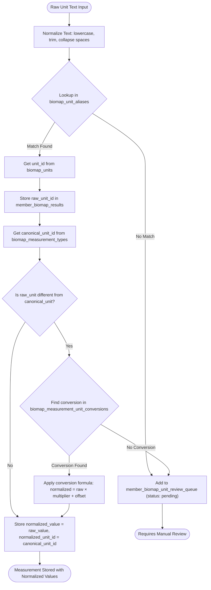

# Biomap - Biomarker Measurement Schema

A scalable Supabase/Postgres schema for storing lab/biomarker measurements with flexible raw unit text handling and canonical unit normalization.

## Overview

This schema enables ingestion of biomarker measurements with any unit spelling (e.g., "mg/dL", "mg/dl", "mg per dl", "mgdl") while maintaining the ability to normalize all values to canonical units for analysis and comparison. The design supports:

- **Flexible ingestion**: Accept raw unit text as provided by labs/devices
- **Normalization**: Map infinite unit spellings to canonical units via alias lookup
- **Conversion**: Convert values between units using defined conversion formulas
- **Time-series analysis**: Optimized indexes for efficient member and measurement-type queries
- **Review workflow**: Queue system for handling unrecognized units

## Schema Architecture

### Lookup Tables (biomap_*)

The lookup tables define the canonical structure of measurements:

- **biomap_measurement_dimensions**: Core dimension types (concentration, ratio, activity, etc.)
- **biomap_units**: Canonical unit definitions linked to dimensions
- **biomap_unit_aliases**: Normalized text aliases enabling flexible unit text matching
- **biomap_measurement_types**: Biomarker definitions with canonical units (e.g., "Fasting Glucose" → mmol/L)
- **biomap_measurement_unit_conversions**: Conversion formulas between units (multiplier + offset)
- **biomap_reference_ranges**: Reference ranges by measurement type, unit, sex, and age

### Member Tables (member_biomap_*)

The member tables store actual measurement data:

- **member_biomap_results**: Fact table storing all measurements with both raw and normalized values
- **member_biomap_unit_review_queue**: Queue for handling unrecognized units requiring manual review

## Unit Classification Flow

The following diagram illustrates how raw unit text is processed and normalized:



### Flow Explanation

1. **Input**: Raw unit text (e.g., "mg/dL", "mg per dl") is received with a measurement value
2. **Normalization**: Text is normalized (lowercase, trimmed, spaces collapsed) to enable consistent matching
3. **Alias Lookup**: Normalized text is searched in `biomap_unit_aliases` table
4. **Unit Resolution**: If found, the corresponding `unit_id` is retrieved from `biomap_units`
5. **Canonical Unit**: The measurement type's canonical unit is retrieved from `biomap_measurement_types`
6. **Conversion Check**: If the raw unit differs from the canonical unit, a conversion is sought
7. **Value Conversion**: If a conversion exists, the formula is applied: `normalized_value = raw_value × multiplier + offset`
8. **Storage**: Both raw and normalized values/units are stored in `member_biomap_results`
9. **Review Queue**: If any step fails (no alias match, no conversion), the measurement is queued for manual review

## Design Principles

### Normalization Strategy

- **Alias Storage**: All `alias_text` in `biomap_unit_aliases` should be stored in normalized form (lowercase, trimmed)
- **Ingestion Guidance**: Normalize incoming unit text before lookup operations
- **Conservative Normalization**: Avoid over-transforming text to prevent false matches

### Data Integrity

- **Cascade Deletes**: Member results cascade delete when members are removed
- **Foreign Key Constraints**: All relationships enforced at the database level
- **Unique Constraints**: Prevent duplicate dimensions, units, aliases, and measurement types

### Query Optimization

- **Time-Series Indexes**: Composite indexes on (member_id, measured_at) and (measurement_type_id, measured_at)
- **Member Type Queries**: Index on (member_id, measurement_type_id, measured_at) for member-specific biomarker tracking
- **Lookup Optimization**: Index on normalized alias_text for fast unit resolution

## Usage Examples

### Inserting a Measurement

```sql
-- Insert a measurement with raw unit text
INSERT INTO member_biomap_results (
    member_id,
    measurement_type_id,
    measured_at,
    source,
    raw_value,
    raw_unit_text
)
VALUES (
    '550e8400-e29b-41d4-a716-446655440000'::uuid,
    (SELECT id FROM biomap_measurement_types WHERE slug = 'fasting_glucose'),
    '2024-01-15 08:00:00+00'::timestamptz,
    'LabCorp',
    100,
    'mg/dL'
);
```

### Querying Normalized Values

```sql
-- Get all fasting glucose measurements for a member in canonical units
SELECT 
    mbr.measured_at,
    mbr.raw_value,
    mbr.raw_unit_text,
    mbr.normalized_value,
    bu.unit_code as normalized_unit
FROM member_biomap_results mbr
JOIN biomap_units bu ON bu.id = mbr.normalized_unit_id
WHERE mbr.member_id = '550e8400-e29b-41d4-a716-446655440000'::uuid
  AND mbr.measurement_type_id = (SELECT id FROM biomap_measurement_types WHERE slug = 'fasting_glucose')
ORDER BY mbr.measured_at DESC;
```

### Handling Review Queue

```sql
-- Check pending unit reviews
SELECT 
    mbr.id as result_id,
    mbr.raw_unit_text,
    mbru.normalized_alias_text,
    mbru.status
FROM member_biomap_unit_review_queue mbru
JOIN member_biomap_results mbr ON mbr.id = mbru.member_biomap_result_id
WHERE mbru.status = 'pending'
ORDER BY mbru.created_at DESC;
```

## Phase 2: Normalization Functions

The following functions are planned for future implementation to automate the normalization workflow:

### biomap_normalize_unit_text(text)

Normalizes unit text for consistent lookup:
- Converts to lowercase
- Trims whitespace
- Collapses multiple spaces to single space
- Returns normalized text

**Usage:**
```sql
SELECT biomap_normalize_unit_text('  Mg/dL  '); -- Returns: 'mg/dl'
```

### biomap_apply_normalization(result_id uuid)

Automated normalization workflow function that:
1. Normalizes the `raw_unit_text` from a `member_biomap_results` record
2. Looks up the normalized text in `biomap_unit_aliases`
3. Sets `raw_unit_id` if match found
4. Retrieves the canonical unit for the measurement type
5. Applies conversion if needed and sets `normalized_value` and `normalized_unit_id`
6. Creates/updates a `member_biomap_unit_review_queue` entry if no match/conversion found

**Usage:**
```sql
SELECT biomap_apply_normalization('550e8400-e29b-41d4-a716-446655440000'::uuid);
```

## Naming Conventions

- **Lookup tables**: `biomap_*` prefix
- **Member/fact tables**: `member_biomap_*` prefix
- **Snake_case**: Used throughout (table names, column names, slugs)
- **UUIDs**: All primary keys use `gen_random_uuid()`
- **Timestamps**: All tables include `created_at` and `updated_at` (auto-maintained via trigger)

## Extending the Schema

### Adding a New Measurement Type

1. Ensure the dimension exists in `biomap_measurement_dimensions`
2. Verify the canonical unit exists in `biomap_units` for that dimension
3. Insert into `biomap_measurement_types` with the canonical unit reference
4. Add conversion formulas to `biomap_measurement_unit_conversions` as needed

### Adding Unit Aliases

When encountering new spellings of existing units:
1. Normalize the alias text (lowercase, trim)
2. Insert into `biomap_unit_aliases` with reference to the appropriate `unit_id`

### Handling Non-Numeric Values

The schema supports non-numeric values (e.g., "<5", "trace", "negative") via the `raw_value_text` column. These can be stored without normalization, or handled through custom logic in application code.

## Future Considerations

- **Unit Validation**: Consider adding dimension validation to ensure conversions only exist between compatible units
- **Bulk Normalization**: Batch processing functions for normalizing historical data
- **Unit Discovery**: Automated suggestions for alias additions based on review queue patterns
- **Reference Range Validation**: Functions to flag measurements outside expected ranges
